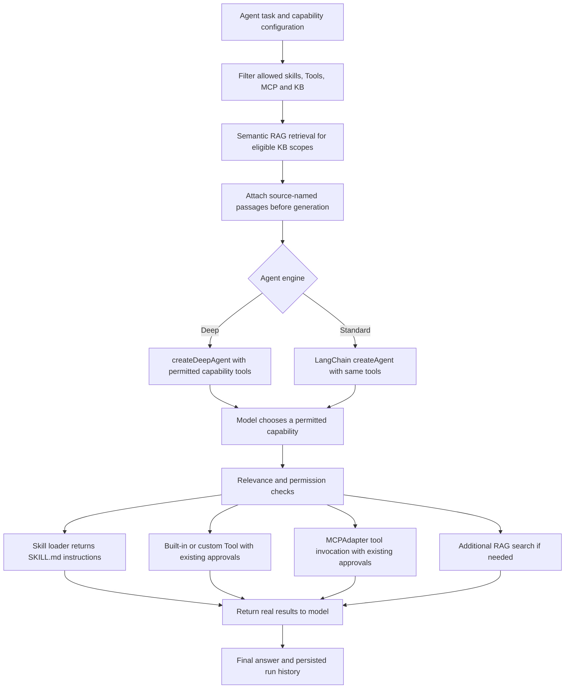

# Agent runtime and contributor rules

## Agents sidebar menu

Create an agent with instructions, a provider configuration and model, enabled skills, tools, and knowledge sources.
The editor supports Form, Markdown, JSON, and YAML definitions, validated against the same schema.
Optionally select a project folder and submit a task. Leave the task empty to run the configured instructions. Inspect the run's output and review each proposed
file change before approving or rejecting it. Execution is bounded by the configured limits.
Definitions can be edited, imported, exported, or deleted after confirmation. Select individual
agents or **Select all Agents**, then **Delete Selected** to confirm a bulk deletion. Cancel
leaves the definitions intact. Deleting a definition does not automatically delete its execution
history; completed history entries can be removed separately from **Execution history**.

Agents can also run from Chat: type `/agent ` and select an agent, or enter `/agent <name>`.
The task and project folder are optional. Progress, diffs, approvals, and the result appear in Chat.
The same configured tools, model, knowledge, execution limits, and approval rules apply.

## Library groups

Agents, MCP, Skills and Tools each support named groups. Select related items, click
**Group selected**, and enter a new or existing name such as **Video Studio**. Click a
group above the list to see its members; **All** and **Ungrouped** show the other views.
Search and **Select all** apply to the currently visible items.

Each editor also has an optional **Group** field. An item belongs to one group; change
that name to move it, or leave it empty to ungroup it. New items created inside a group
inherit its name. Group names persist in definition files and their imports/exports.
If moving items leaves a group empty, its name remains available until **Delete group** is used.
Bulk grouping changes metadata only and does not restart MCP servers or run agents.

## Code side menu

**Code** connects saved project folders to Chat. Ordinary messages in a linked conversation
use the DeepAgents/ACP coding assistant and the current local Chat provider/model; no saved agent is required. Explicit saved-agent runs retain their configured engine and provider. See [Code](CODE.md) for runtime sessions and local endpoint requirements.
Project operations default to per-operation approval, with file diffs for changes. Workspace
rules and selected-agent permissions are intersected; denial always wins. A selected agent
inherits the linked folder unless an explicit one-run folder is supplied.

The Code task form lists dedicated agents marked `agentRuntime: deepagents-acp`.
Choose **Agent template → Add agent** to create multiple Coding, Test Cases, Test Runner,
Code Review, MR Preparation, Commit and Push, Refactoring, Documentation, or Custom agents.
**Edit agent**
opens the shared editor for the selected profile. Definitions persist in the agent library;
unrelated agents do not appear in the Code selector. Each coding profile requires a local
provider/model and a selected project. Runs use isolated ACP sessions, cleaned up on completion,
failure, or cancellation, including when a coding profile runs from a saved workflow.
Review and MR templates start read-only; MR Preparation produces a draft without publishing.
Commit and Push uses approval-gated, explicit file selection for staging and committing, plus
separate approval for pushing to the current branch's configured upstream. It does not force-push
or include unrelated staged files.
Select a project and task, or use **Fix failing tests** to reproduce, correct and rerun a failing
test without weakening it. Both paths reuse capability routing, iteration limits, cancellation,
diff review and execution history. Linked-folder tasks cannot be regenerated accidentally.

To let an agent retrieve saved notes, select the **Saved Text** knowledge source in its editor
and ensure that source is ready in [Knowledge Base](KNOWLEDGE_BASE.md). Agent knowledge choices
are separate from Chat's knowledge selector. See [Settings](SETTINGS.md) for execution settings.

## Provider selection

Each agent saves its own provider ID and model, independent of the application default.
The editor shows only the model selector with one enabled provider; multiple enabled providers
show both selectors. Changing provider clears incompatible models and selects its valid default
when available. Cards and chat headers display the saved provider/model.

**Open in Chat** initializes the saved pair. Chat selector changes create a conversation override;
**Save to Agent** explicitly writes it back. Missing/disabled providers and unavailable models
must be reassigned before running. Provider deletion is blocked while any agent references it,
including disabled agents. The error lists all affected agent names and offers **Manage agents**.

## Reusable agent definitions

Agents live in `<userData>/agents/<id>.md`, with YAML metadata and a Markdown instruction body:

```md
---
name: Project reviewer
description: Review a selected project
providerId: ollama-local
model: qwen3-coder:latest
skills: []
tools:
  - project.detect
  - filesystem.read
  - filesystem.search
  - git.diff
knowledgeSources: []
maxIterations: 5
enabled: true
---

Inspect relevant files, explain findings, and state which checks you ran.
```

The model name is illustrative; choose an installed model. The runtime considers eligible
capabilities and loads skills after a relevance decision. Eligible KB passages are retrieved
before the first model request; follow-up KB tools use relevance checks. It sends
a bounded history to the selected provider adapter. LangChain `createAgent` manages native tool calls and final answers. A model turn can
request multiple tools, which the application executes in order. Only capabilities permitted by the agent's mode, type switches, selection and permissions can execute. Tools
return their real output; errors are fed back so the model can recover. A maximum iteration
count, a 15-minute deadline and cancellation bound every run.

Filesystem read returns content plus a SHA-256 hash. Write/edit checks that hash, displays a
unified diff, waits for approval by default, checks again, writes atomically and verifies the
content. Native tool use requires a tool-capable model; there is no legacy JSON-action fallback.
A fresh run reads its explicit definition, skills, knowledge and any selected project
files; previous execution history is not automatically included in its model context.

## Optional folder context

Chat and Run Agent use the same folder selector. **Select Folder** opens the native picker;
the selected full path is shown with **Change Folder** and **Remove Folder**. Changing it
replaces the selection; removing it clears the current context. Cancelling the picker keeps
the previous selection. These are temporary selections, not saved agent defaults. Chat clears
its selection after sending or changing conversations; reopening Run Agent starts without one.
The path used for a run is retained in history.

Without a folder, the agent can use its configured instructions, skills, knowledge, custom
Tools and MCPs. Built-in filesystem, project, Git and package-script tools are unavailable.
A selected folder scopes built-in tools; it does not sandbox custom code or MCP servers.

## Tools and execution limits

Select built-in tools, discovered MCP tools (`mcp:<server-id>:<tool-name>`), or enabled
[custom Tools](TOOLS.md) (`custom:<tool-id>`) in the editor. Selected mode permits only selected capabilities; Auto considers all enabled capabilities.
Custom Tool and MCP calls require approval by default, including in global full-auto mode;
per-capability Always allow overrides that approval default. Inputs,
outputs and failures are recorded in the run; tool errors are returned to the model so it
can recover. Referenced skills, Tools and MCPs cannot be deleted until all agent references are
removed, including references in disabled agents. The deletion error appears at the top of the
confirmation modal and names the affected agents.

**Maximum execution iterations** accepts 1–500 and is saved as `maxIterations`. New agents
start with the global Settings value. Older definitions without this field inherit the global
limit when run. An iteration is one model turn, including tool requests and the final report;
it is not a count of tool calls. Runs stop on completion, the limit, a fatal error, cancellation,
or the 15-minute deadline. A reached limit has its own status rather than being reported as success.
There is no separate agent-generation workflow or generation-iteration setting in this release.

## Execution history

Expand a run in the **Execution history** accordion to inspect its request, folder, start/end
times, duration, iterations used/maximum, actual MCP calls, tool inputs/outputs/errors,
execution events and final result. Status is **Running**, **Completed**, **Failed**,
**Cancelled**, or **Max iterations reached**. For example, `2 / 5` means two model turns
were used out of five allowed. Active runs can be stopped and pending operations approved
or rejected from the expanded entry. Completed, stopped, failed, cancelled, and max-iteration
runs have a **Delete history** action. Running entries must be stopped before their history can
be deleted.

History persists in `<userData>/database/agent-runs.sqlite`, separately from Markdown agent
definitions. Runs interrupted by application shutdown are marked Cancelled on restart.
Progress shows application-generated Thinking/Planning, tool activity and approval states.
Raw model planning fields are neither displayed nor stored in history; there is no empty
numbered planning list.

Read [SECURITY.md](SECURITY.md) before enabling automatic approvals, custom Tools or MCP tools.

## Deep Agents engine (optional)

Settings → General → **Agent engine** selects the standard LangChain `createAgent`
runtime (stored as `classic` for compatibility) or Deep Agents (`deepAgentMode: 'deep'`).
Both use the agent's saved provider/model, selected capabilities, approvals, iteration
limit, 15-minute deadline, cancellation and execution history. Folderless runs work in
both engines; filesystem/project tools require a selected folder.

Deep mode adds LangChain todo planning. All workspace, custom Tool, MCP, skill and
knowledge operations use the same guarded native tools as standard mode. The harness's
default filesystem/shell/delegation tools are unavailable because they do not implement
this application's capability boundary. Use saved Workflows for multi-agent execution.
See [LangChain migration](LANGCHAIN_MIGRATION.md) and [Capability decisions](CAPABILITIES.md).

## Repository changes

- Preserve the file-vs-database storage boundary from `desing.md`.
- Keep privileged behavior in main services and validate every IPC request.
- Keep secrets out of API results, logs and portable exports.
- Add relevant service/boundary tests for new privileged operations.
- Run `pnpm typecheck`, `pnpm lint`, `pnpm test`, and `pnpm build` after changes.
- For UI changes, run `pnpm test:ui` against the new build; live tests are opt-in.
- Use TypeScript, provider interfaces, small service modules and formatted source.
- Electron's bundled Chromium is the only renderer browser target.
- Do not substitute simulated production responses for unavailable services.

See [Capability decisions](CAPABILITIES.md) for Auto/Selected/None modes, restrictions,
permissions, relevance checks and decision traces.

In **Capability permissions**, Selected mode shows dropdowns only for checked tools and MCP servers
of allowed types. Skills and Knowledge Base are allowed by default and need no permission
dropdowns or approval prompts. Selection and relevance checks still apply. Unchecking a capability hides its dropdown without clearing its permission.
Auto shows all listed tools/MCPs of allowed types; None hides permission dropdowns.

## Agent workflows

Open **Workflows** to create, edit, duplicate, or run a saved workflow. Add existing agents,
reorder them with Move up/Move down, and use the graph preview to inspect the execution order.
Sequential mode runs the listed order; Parallel mode runs independent agents; Mixed mode lets
users select the required predecessors of each agent. Each node waits for all of its predecessors
to succeed. Changing execution mode clears the previous connections.

Connections pass the full `result` by default. JSON outputs can select a field such as
`result.issues`; missing fields fail the receiving node with a mapping error. The target can be
previous-agent context or a prompt section. Aggregated context includes the source node, agent,
run ID, and status. Each node can also have its own task, in addition to the workflow run's task.
Folder selection is optional and applies to every child agent. Child agents retain their saved
provider/model, capabilities, approval rules, maximum model iterations, and 15-minute deadline.

**Maximum depth** bounds the dependency chain. **Maximum agent executions** (`maxIterations` in
the workflow file) bounds the number of node executions, separately from each agent's model
iterations. Every node runs at most once; cycles, missing connections, duplicate node IDs, and
unsafe output paths are rejected before saving or running. Workflows share the application's
three-agent concurrency limit; additional ready agents wait for capacity. At most three workflows
can be active. Failed upstream agents block dependents while independent branches may finish.
Cancel workflow stops running children and prevents waiting nodes from starting.

Definitions are JSON files in `<userData>/workflows/`. Execution snapshots and node-to-agent-run
links are stored separately in `<userData>/database/workflow-runs.sqlite`. Expand workflow history
to inspect individual execution details, iterations, output, tools, diffs, and approvals. Deleting
or editing a definition preserves past execution snapshots. Unfinished workflows become Cancelled
on application restart. Progress is generated from execution events, never private model planning.

In Chat, select `/workflow ` and a saved workflow, or type `/workflow <workflow-name>` followed
by an optional task. Names containing spaces work, including quoted names. Optional folder controls
are available before sending. Chat displays workflow and child progress, supports concurrent
approvals, and returns the final agents' results. Stop generation cancels the whole workflow.

## Deep Agents: skills, tools, MCP and upfront KB context

Deep Agents receives the same permitted LangChain capability tools as the standard
engine. Enable Tools, MCP, Skills and Knowledge Base in the agent's capability
configuration, then select the capabilities (or use Auto). None mode exposes none.
Built-in filesystem/project/shell tools also require a selected folder. Custom
Tools and MCP calls retain their approval rules. A skill adds instructions; it
cannot enable capabilities excluded by the agent's configuration.

Before the first agent generation request, the service fetches semantic RAG passages
for every eligible KB scope and attaches them to the system context. Source names
are included for citations. Empty results are explicitly reported, and retrieval
failures stop the run rather than inventing KB context. The combined KB attachment
is redacted and bounded to 30,000 characters; the model context budget still applies.
KB tools remain available for follow-up searches. Both standard and Deep engines
use this preparation. Plain Chat with no selected modes remains model-only.



| Responsibility                                             | Code reference                                                           |
| ---------------------------------------------------------- | ------------------------------------------------------------------------ |
| Skill files                                                | `<userData>/skills/<skill-id>/SKILL.md`                                  |
| Capability selections and type switches                    | `src/shared/capabilities.ts`, `src/main/services/agents/capabilities.ts` |
| Skills, tools, MCP registration and upfront RAG attachment | `src/main/services/agents/agents.ts`, `AgentService.loop`                |
| Deep engine receives allowed tools                         | `src/main/services/ai/deep-agents.ts`, `DeepAgentEngine.create`          |
| LangChain orchestration and tool filtering                 | `src/main/services/ai/agent-graph.ts`, `AgentLoopGraph.run`              |
| Ordered execution, approvals and history                   | `src/main/services/ai/capability-tools.ts`                               |
| MCP adapter                                                | `src/main/services/mcp/mcp.ts`                                           |
| RAG retrieval                                              | `src/main/services/rag/knowledge.ts`, `KnowledgeService.search`          |
| Standard/Deep upfront-RAG and allowed-tool regression      | `tests/agent.integration.test.ts`                                        |

Skills are currently application capability tools reading the stored SKILL.md,
not Deep Agents' native filesystem skills loader. The harness's additional default
filesystem and delegation tools remain filtered; authorized workspace operations
use the supplied application tools.
