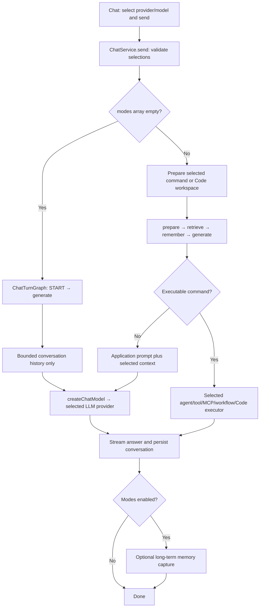
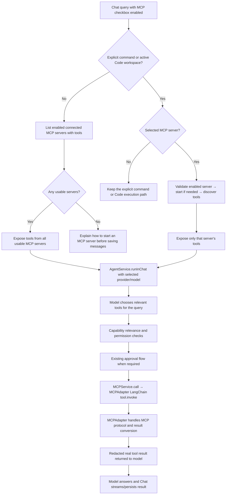
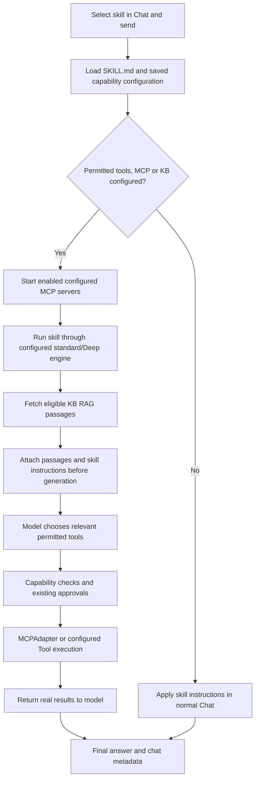

# Chat

Chat with Ollama or a configured hosted provider and optionally use your indexed knowledge as reference material.

## Direct model chat (no checkboxes selected)

Leave **KB, MCP, Tools, Skills, Code, Agent, and Workflow** unchecked to talk directly
to the selected provider/model. This is the default for testing an LLM. A provider
and model are still required. The request contains bounded conversation history,
including the current user message, with no application system prompt, agent
instructions, tool definitions, knowledge retrieval, or long-term memory retrieval
or capture. A previously linked Code folder or remembered KB scope does not activate
capabilities. Earlier conversation messages remain in context; start a fresh chat
for an isolated test. Slash commands require their matching checkbox.



Code references for future changes:

| Responsibility                                                              | Code                                                                         |
| --------------------------------------------------------------------------- | ---------------------------------------------------------------------------- |
| Default empty checkboxes                                                    | [`useUI.chatModes`](../src/renderer/stores/index.ts)                         |
| Build send payload and gate remembered agent by checkbox                    | [`Chat.send`](../src/renderer/features/chat.tsx)                             |
| Command selection and slash resolution                                      | [`useChatCommands`](../src/renderer/features/chat-commands.tsx)              |
| Reject unchecked commands; disable KB and linked Code folder                | [`ChatService.send`](../src/main/services/ollama/chat.ts)                    |
| Set `pureModel` and skip memory capture                                     | [`ChatService.generate`](../src/main/services/ollama/chat.ts)                |
| Direct graph branch and prompt-free history                                 | [`ChatTurnGraph.build` / `modelNode`](../src/main/services/ai/chat-graph.ts) |
| Selected provider's LangChain model                                         | [`createChatModel`](../src/main/services/ai/langchain-model.ts)              |
| Regression: no commands, tools, KB, memory, system prompt; history retained | [`tests/chat-commands.test.ts`](../tests/chat-commands.test.ts)              |

Keep the direct branch and `pureModel` prompt guard together when changing routing.
The graph coordinates streaming and persistence; it does not run an agent in this branch.
Legacy callers that omit `modes` retain their existing context behavior; the Chat UI
always sends an explicit array.

## MCP checkbox: automatic or selected server

Check **MCP** and enter a normal query without choosing a server to make tools from
all enabled, connected MCP servers available. The model chooses relevant tools by
their descriptions and answers using their real results. This does not call every
server for every query. Disabled, stopped, and tool-less servers are excluded. If
none are usable, Chat asks you to start a server in the MCP menu before sending.

Choose an MCP server from `/mcp ` to limit the request to that server's tools.
Other servers are excluded. An enabled selected server starts automatically when
you send if it is stopped; Chat waits for tool discovery before execution. Startup
failures are shown before saving the message. MCP calls retain the existing relevance checks,
permissions, approval prompts, cancellation, and execution limits. Only MCP tools
are granted by either path; built-in project tools and custom Tools are not added.
KB context can also be supplied when its checkbox is checked.



| Responsibility                                                                             | Code                                                                          |
| ------------------------------------------------------------------------------------------ | ----------------------------------------------------------------------------- |
| Trigger all-server fallback only with MCP checked and no prepared execution                | [`ChatService.send`](../src/main/services/ollama/chat.ts)                     |
| Filter usable servers and construct MCP-only tool selection                                | [`ChatCommands.prepareAllMCP`](../src/main/services/ollama/commands.ts)       |
| Restrict an explicit MCP selection to one server                                           | [`ChatCommands.prepare`, MCP branch](../src/main/services/ollama/commands.ts) |
| Register tools, check capability permissions, handle approvals                             | [`AgentService.loop`](../src/main/services/agents/agents.ts)                  |
| Connected server state and actual MCP calls                                                | [`MCPService.states` / `call`](../src/main/services/mcp/mcp.ts)               |
| Tests for all-server routing, excluded servers, real results, approvals and selected scope | [`tests/chat-commands.test.ts`](../tests/chat-commands.test.ts)               |

MCP uses `MCPAdapter` from `@langchain/mcp-adapters` in
[`MCPService`](../src/main/services/mcp/mcp.ts). `start` constructs an adapter for
one saved server and calls `listTools`; `call` invokes the adapter's executable
LangChain tool; `stop` closes the adapter. Server-specific adapters preserve the
MCP menu's independent Start/Stop/Restart controls. Raw tool names remain stable
in saved capability IDs; provider-safe names are applied by `createCapabilityTools`.
Both all-server and selected-server Chat paths use this same integration.
The capability wrapper retains relevance, approvals, ordered execution and history;
MCP protocol handling and tool conversion belong to the official adapter.
Results are redacted and bounded before entering Chat and run history. Raw process
stderr is suppressed because it can contain resolved credentials; connection and
protocol errors are recorded as redacted application logs.

Explicit commands and an active Code workspace take precedence over this fallback.
Changing the MCP checkbox never expands an explicitly selected server's scope.
Opening a linked workspace from the Code page attaches it to the conversation and enables the
**Code** checkbox for that chat.
The folder's **Configure Agent** permissions include the app-managed **Coding assistant**
(`builtin-coding-agent`), selected by default alongside saved agents for folders without custom
agent permissions. In Chat, the folder's **Configure Agent** selections control which enabled
DeepAgents ACP agents are registered, including the built-in Coding assistant. Folder resource
selections also limit each agent's tools, skills, MCP servers, and knowledge sources.
MCP, Skills, Agents, Knowledge Base, and Tools libraries include a protected **Built-in** group
for organizing application-provided resources; the Saved Text knowledge source is assigned to it
automatically.

## Provider and model selection

Choose the provider and model in the **chat header**. With one enabled provider, only the
model selector appears; with multiple enabled providers, both selectors appear. Missing or
disabled selections block sending. Use the dropdowns or **Use [provider]** to recover; redundant
provider-unavailable and select-an-available-model labels are not displayed alongside them.
No enabled providers shows a setup action.

Each conversation persists its selection. Changes preserve history and apply to subsequent
requests; an in-flight request retains the provider, credential, and model captured at send time.
Assistant messages show historical provider/model labels and completion status. Renaming or deleting
a provider does not rewrite those labels. Partial responses survive restart and interrupted streams
are marked canceled. Older messages without attribution are explicitly labeled as legacy.

**Open in Chat** initializes an agent's saved provider/model. The header identifies conversation
overrides. **Save to Agent** explicitly updates the definition; ordinary selector changes do not.
See [Multi-provider AI](MULTI_PROVIDER_AI.md) for setup, migration, and adapter scope.

## Ask questions about Saved Text

1. Create and save a note in **Saved Text**.
2. Open **Knowledge Base** and wait for the **Saved Text** source to become ready.
3. Open **Chat** and select a model from your configured provider.
4. In **Knowledge context**, choose **Collection: Saved Text** or **All knowledge**.
5. Ask your question. Expand **Sources used** below the response to inspect retrieved excerpts.

The feature is implemented. Saving a note automatically schedules indexing, but Chat defaults
to **No knowledge context**. With that option selected, the question does not search RAG.
Selecting a source supplies matching excerpts to the model; it does not enforce answers exclusively
from those excerpts. The model is instructed to cite source names and acknowledge insufficient context.

Use **Settings → AI Providers** to configure providers, then select one in the chat header: local Ollama or a hosted provider such as OpenAI,
Anthropic Claude, Google Gemini, OpenRouter, Groq, or a custom OpenAI-compatible endpoint.
Selection does not automatically trigger retrieval. A capability decision searches only when
stored or project-specific information is needed; general questions can be answered directly.
Only ready sources are retrieved. If a source fails to index, correct the reported problem and
use **Sync / Re-index** in Knowledge Base.

## Slash commands

Type `/` for command types, then `/mcp `, `/agent `, or `/skills ` for a searchable list of
enabled items. Use Up/Down and Enter, or click an item. Escape dismisses suggestions.
Selection creates a removable chip. Skills and MCP apply to the next message; an agent establishes a conversation context until removed. Enter your query
and send with Enter or the arrow. Shift+Enter inserts a new line; Cmd/Ctrl+Enter also sends. Names with spaces can also be entered explicitly:

```text
/mcp "My server" "Find the requested information"
/agent "Code reviewer" "Review authentication"
/skills "Documentation" "Explain this API"
```

- **Skills:** applies the selected skill's instructions only when the capability decision finds
  its workflow relevant and necessary for the request.
  Instruction-only skills use conversation history and selected Chat knowledge context. Skills with saved capabilities run through the configured agent engine; see the skill capability graph below.
- **Agent:** initializes the saved provider/model and uses the conversation’s effective selection, skills, selected tools,
  knowledge sources and execution limit. The Chat knowledge selector does not override the
  agent's configured sources. A task and project folder are optional; `/agent <name>` alone
  runs the configured instructions.
- **MCP:** uses the current chat model to choose tools from the selected connected server only.
  The selected enabled server starts automatically when you send. The selected Chat knowledge context is available to this run.
  No built-in filesystem or shell tools are granted by this command.

### Agent folders and progress

Selecting an agent shows optional folder controls beside the × button in the command bar,
with the full path (or **No folder selected**) below. Typing `/agent ` before selecting an
agent also shows a folder selector. Use
**Select Folder** to choose a folder, **Change Folder** to replace it, or **Remove Folder**
to clear it. The full path is displayed and stored with the submitted command. Cancelling
the picker leaves the current selection unchanged and does not prevent a folderless run.
The selection clears after sending or changing conversations; it is not a permanent default.
Without a folder, built-in filesystem, Git, project and package-script tools are unavailable.
Configured custom Tools, MCPs, skills and knowledge can still be used.

Thinking/Planning displays safe progress generated by the app. Tool activity, approvals,
completion and errors replace it as execution proceeds. Raw model planning fields are not
shown. Agent runs also appear in the persistent [Agents history](AGENTS.md#execution-history),
including iteration usage and a distinct status when the maximum is reached.

Agent and MCP commands start a fresh task using the submitted query; they do not inherit the
whole conversation. Progress, tool results, and approval controls appear inline. MCP
and custom Tool calls require approval by default; saved agents may override this with
per-capability Always allow permissions. Agent file changes follow the existing approval settings and
hash checks. Stop generation cancels the associated run, including pending approvals.

Results, command names, and the latest 100 activity events persist with the conversation.
Historical approval controls cannot execute again. Commands cannot use Regenerate; send a
new command to repeat a task deliberately. Ordinary messages use normal chat unless an agent or linked workspace is active.

### Linked Code workspaces

Type `/code` to list saved folders directly in Chat. Type a folder name or path after `/code `
to filter the list, then click a folder or select it with the arrow keys and Enter. Chat stays open
and the selected workspace connects to the current conversation. **Open another folder…** opens
the native folder picker; **Connect project** in the Chat header also opens it.
Recent linked workspaces can also be reconnected from Code in another
conversation, and missing folders can be relinked through the native picker. Reopening a
conversation restores its workspace indicator. Disconnecting removes only that conversation's
link. Send a task to use the built-in coding assistant with the current provider/model; no saved
agent is needed. It can inspect, search, edit, create and delete individual project files, inspect
Git, and run approved development commands. Project operations require approval by default;
file changes show diffs. Progress, approvals, results and failures use the existing Chat activity
and execution history. Recent conversation text is provided as bounded context, and files are
read only through tools. Reopening a linked conversation retains its project context.

A selected saved agent inherits the linked folder unless a one-run folder is explicitly selected,
and keeps its capability restrictions. Code's optional task form offers all enabled providers.
Disconnect the workspace to return to ordinary Chat. See [Code Workspaces](CODE.md) for status.

## Conversation history

Create, search, rename, delete, and reopen conversations. Use the trash button in the
history header to remove all local chat history at once, or delete a single conversation from
the row actions. Send with the arrow button or Enter (or Cmd/Ctrl+Enter). Use Shift+Enter
for a new line. Enter confirms an open slash-command suggestion first, and does not send while
an IME is composing text. Stop an active response, regenerate a response, or copy message text.
Conversation history and retrieved source excerpts are stored locally in SQLite. Model selection
is provider-aware, so the same chat can use local Ollama or a remote API such as OpenAI,
Anthropic, Google, OpenRouter, Groq, or a custom compatible endpoint.

See [Agents](AGENTS.md), [Tools](TOOLS.md), [Saved Text](SAVED_TEXT.md), [Knowledge Base](KNOWLEDGE_BASE.md), and [Settings](SETTINGS.md).

See [Capability decisions](CAPABILITIES.md) for Auto/Selected/None modes, restrictions,
permissions, relevance checks and decision traces.

## Checking KB answers

Normal Chat's relevance check receives the selected source names/collections and recent
conversation, including follow-up context. Questions about private/project facts or the selected
documents require retrieval even if the model knows the general topic. Successful retrieval
passes the real passages to the answer model and saves them under **Sources used**.

Expand the response activity to see **Knowledge retrieval** and its passage count. If the
selection has no ready sources, sync/index them in Knowledge Base. Empty or skipped retrieval
is explicitly included in the answer model's context; it must not claim a KB-grounded answer
without retrieved passages. General unrelated questions can still skip RAG.

The selected KB also supplies the subject for ambiguous topical requests. For example, selecting
**agent-desktop** and asking **give me chat details** means the project's Chat feature, not
personal chat history. Both the relevance check and answer prompt receive this scope. Explicitly
unrelated general questions and instructions disabling knowledge still take precedence.

## Long-term memory in chat

With **Enable long-term agent memory** on in Settings, each request first retrieves at
most five relevant memory entries (global plus the current conversation) and injects them
as a bounded background-context block. Saying “Remember that …” stores the stated fact for
this conversation without a model call. After a completed exchange, opt-in automatic
capture may store one concise durable fact; secret-shaped content is never stored and
memory failures never interrupt chat. Management (list/remove/clear per scope) is exposed
over IPC; see [Memory](MEMORY.md). Conversation state itself remains the existing SQLite
history and is unrelated to memory.

## Remembered model selection

Choosing a provider/model manually in Chat remembers that pair for new chats and app
restarts. No separate Save action is needed. Existing conversations retain their own
selections. Opening a saved agent uses its configured provider/model without replacing the
remembered chat choice. If the remembered provider is disabled/removed or its model is no
longer available, new chats use the configured default when valid.

## Chat skills with MCP, Tools and KB

A selected skill can declare `tools`, `knowledgeSources`, or a `capabilityConfig`
with `tools`, `mcpServers` and `knowledgeBases`. When it has permitted execution
capabilities, Chat runs it through the configured standard/Deep agent engine with
that skill's instructions and capability configuration. Enabled configured MCP
servers start automatically. Eligible KB scopes fetch semantic RAG passages before
agent generation; the model then calls permitted MCP/custom tools as needed.
Existing approvals, relevance checks and limits apply. Separate Chat MCP/Tools/KB
checkboxes do not need to be checked for capabilities declared by the skill itself.
The Skills checkbox authorizes selecting this skill and its saved configuration.

Instruction-only skills retain the existing plain-chat behavior. None mode or
disabled type switches prevent granting those capabilities. The selected skill
applies only to the sent turn, not subsequent ordinary messages. Skill files stay
at `<userData>/skills/<skill-id>/SKILL.md`; YAML frontmatter stores the capabilities.



Code: `ChatCommands.prepare` in `src/main/services/ollama/commands.ts` builds the
skill executor; `AgentService.loop` in `src/main/services/agents/agents.ts` attaches
RAG and registers tools; `AgentLoopGraph.run` selects the engine and orchestrates
calls. Regression coverage is in `tests/chat-commands.test.ts` and
`tests/agent.integration.test.ts`.

## Local Code conversations

Ordinary messages with Code enabled and a linked folder use a persistent DeepAgents/ACP session and the selected local model. General Q&A remains available; project operations use the existing approval UI, including file diffs. Switching or disconnecting a folder stops its affected work before changing context. Explicit saved-agent commands retain their configured engine/provider support. See [Code](CODE.md) for model requirements and restart behavior.
