# Application architecture and complete execution flows

This document describes the current implementation, verified against the source on 2026-10-03. Graphs show actual application paths, including configuration, execution, approvals, persistence, failures and cancellation. They do not imply that every selected capability executes.

## 1. Feature roles and execution order

| Feature | Responsibility | Selection behavior |
| --- | --- | --- |
| Chat | Accept messages, choose a command/model, display answers, sources, activity and approvals | Feature checkboxes enable command paths; they do not execute every feature |
| Agent | Combine instructions, model, capability policy and iteration limits | Saved settings determine its eligible capabilities |
| Skill | Supply task instructions; a directly selected skill can also run with its own capabilities | An agent-attached skill loads when called; a direct skill command follows the two paths below |
| MCP | Connect to external servers and expose discovered tools | Agent calls require an enabled, connected server and permitted tool |
| Tools | Execute custom functions or built-in workspace operations | Invocation requires an eligible capability; explicit editor tests execute directly |
| Knowledge Base (KB) | Index documents and retrieve reference passages | Chat context and saved agent KB selections are separate |
| Workflow | Schedule agents by dependencies and pass outputs between them | Each node runs its referenced agent with that agent's settings |
| Code | Connect a workspace and constrain built-in file, shell and Git operations | Workspace policy restricts agent access |
| Memory | Store and retrieve durable background facts | Separate from KB, chat transcripts and graph checkpoints |
| Saved Text | Store notes and refresh their searchable KB collection | Saving notes triggers indexing, not agent execution |

For a saved agent: **load configuration → filter capabilities → retrieve permitted agent KB context → model call → optional capability calls → repeat → final answer**. There is no fixed Skills → Tools → MCP order. Calls within one agent are serialized; separate workflow agents can run concurrently.

## 2. Overall architecture

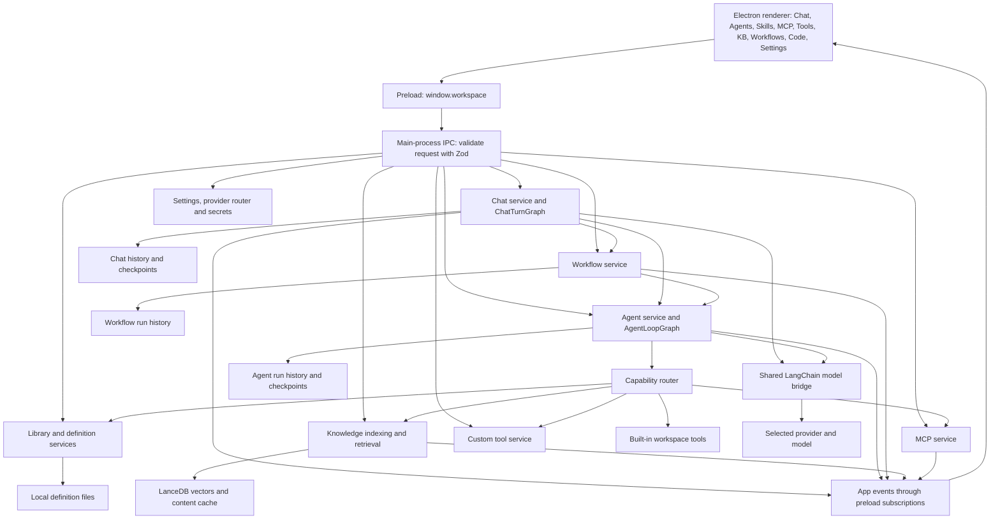

## 3. Chat admission and command priority

The renderer resolves one active command. Enabling several checkboxes does not merge several commands or replace the selected agent's capability configuration.

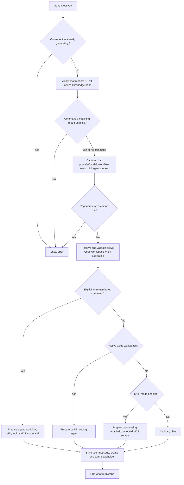

## 4. Chat turn graph: plain chat, context and command execution

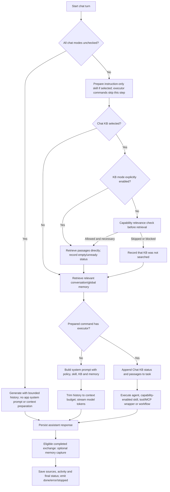

Memory is retrieved at the graph's `remember` node, but an executor command receives the task plus Chat KB context, not the ordinary chat system prompt or its retrieved memory block. Executor command results return as a completed answer; ordinary chat streams tokens.

## 5. Agent initialization and model/tool loop

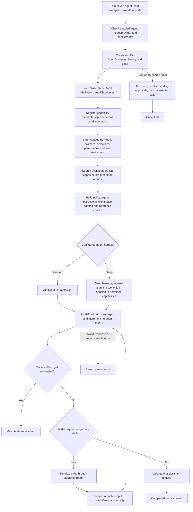

At most three agents run at once. Workflow nodes wait for an available slot; a direct start at capacity fails. The deep harness does not independently authorize filesystem or delegation tools. Agent-attached skills are not all inserted into the initial prompt: their instructions are returned when the model calls them.

## 6. Capability eligibility, relevance and approval

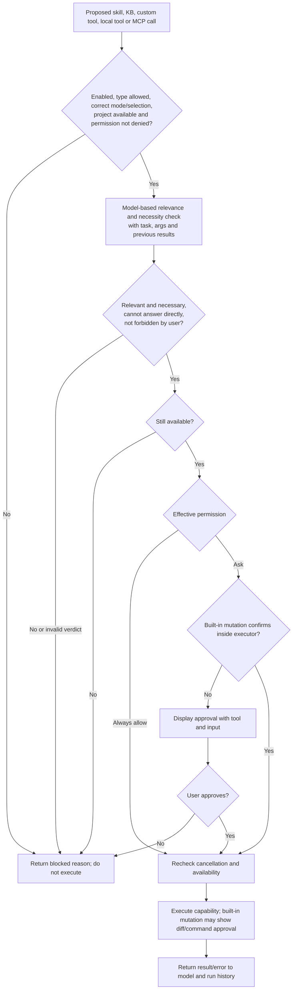

Modes: **None** blocks all capabilities; **Selected** permits selected entries; **Auto** permits eligible entries across allowed types. A deny at any applicable permission scope wins. Skills and KB retrieval do not ask for approval, but an explicit deny still blocks them. Custom tools and MCP default to Ask. Built-in mutations can confirm inside their executor. Upfront agent KB retrieval uses the filtered catalog directly and does not make this per-call relevance request.

## 7. Skills: all three usage paths

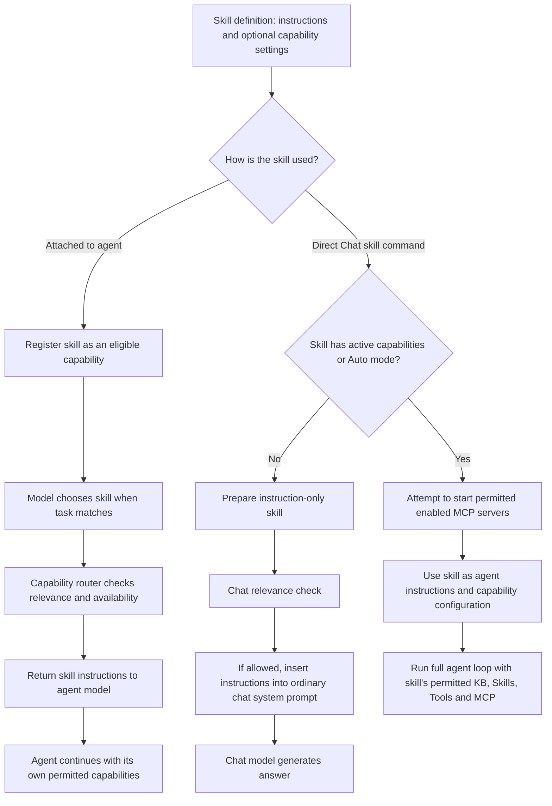

An attached skill supplies instructions; loading it does not replace the parent agent's capability policy. A directly selected capability-enabled skill uses its own capability configuration in the agent wrapper.

## 8. MCP configuration, connection, discovery and calls

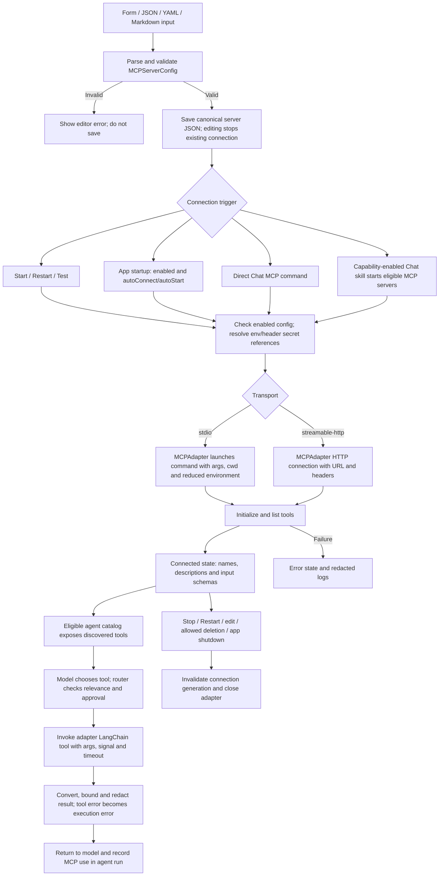

Saved-agent execution does not start all selected MCP servers; its catalog uses already-connected servers. MCP mode without a selected server also uses already-connected enabled servers and fails if none have tools. Direct `/mcp` attempts to connect its selected server. Test pings an existing connection or starts a stopped server. Runtime configuration supports stdio restart settings and tool timeout settings. MCP resource/prompt metadata does not establish an agent resource-reading or prompt-execution path: the implemented agent integration uses discovered tools.

## 9. Custom tools: authoring, conversion, saving and testing

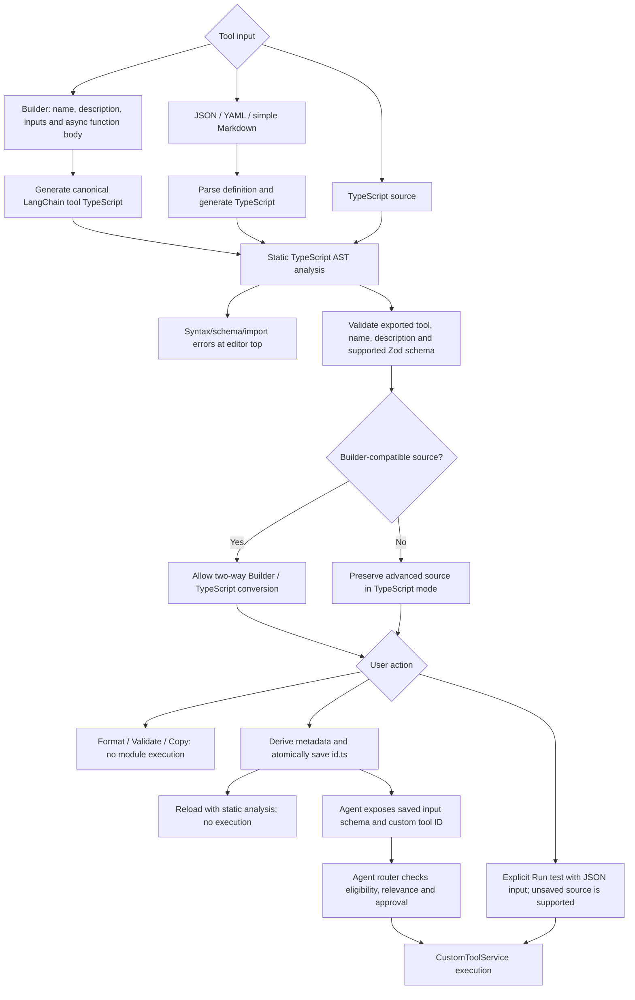

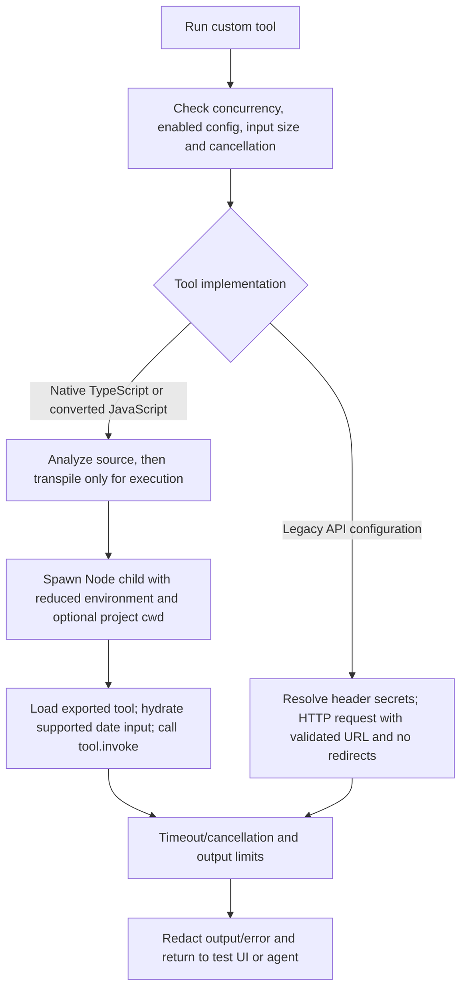

Canonical tool storage is `.ts`, unlike MCP JSON. Legacy Markdown tools remain readable; saving migrates them to TypeScript with the same stable ID. An unchanged legacy API definition retains its existing credential-aware execution path. Static validation does not execute modules or arbitrary callbacks and is not a full semantic TypeScript type check. Child-process isolation is not an OS sandbox. Explicit Tool Test is a direct user invocation and does not pass through the agent relevance/approval router.

## 10. Knowledge Base: indexing, incremental sync and retrieval

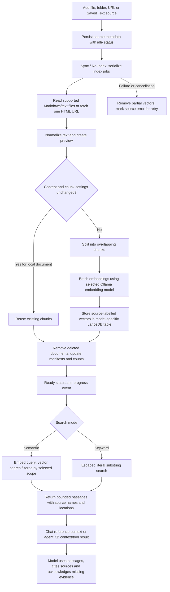

Supported local source content is `.md` and `.txt`; folder traversal ignores configured paths and does not follow symlinks. URL indexing fetches one page, without browser rendering or link crawling. Embedding-model changes require reindexing selected sources. KB groups organize sources; retrieval selects source IDs, collections or all ready sources, not a group name by itself.

## 11. Chat KB versus agent KB

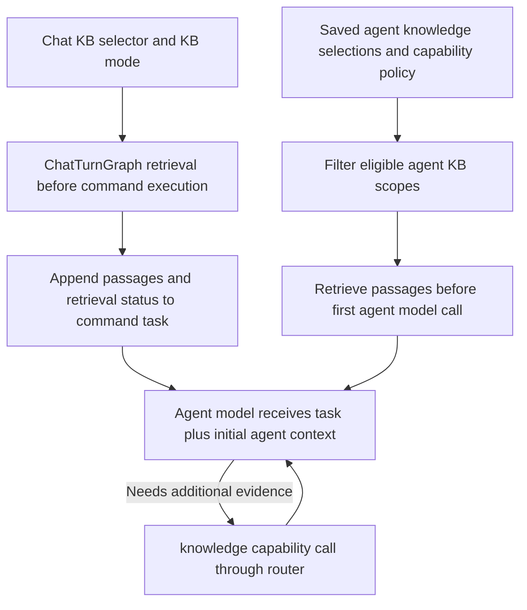

These selections can overlap, so a chat-triggered agent can perform Chat retrieval and then agent retrieval. Chat KB does not overwrite saved agent KB settings. A workflow's Chat KB context travels in its task; individual nodes still use their saved agent KB configuration.

## 12. Workflow definition and scheduling

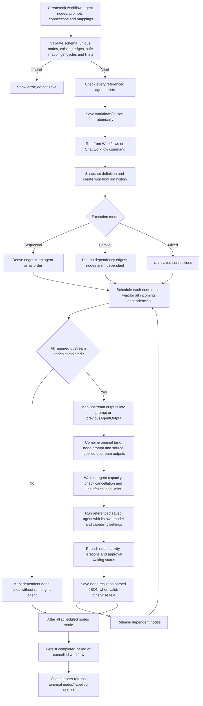

Sequential mode uses list order even if other saved connections exist. Parallel mode ignores dependency edges for execution; saved connections are still validated. Mixed mode uses connections for dependencies. Edge mode labels do not introduce a second scheduler. No conditional branching evaluator or recursive workflow-as-node executor is implemented. Workflow `maxIterations` limits agent-node executions; each agent separately limits model calls. Workflow `maxDepth` validates dependency depth.

## 13. Sequential, parallel and mixed examples

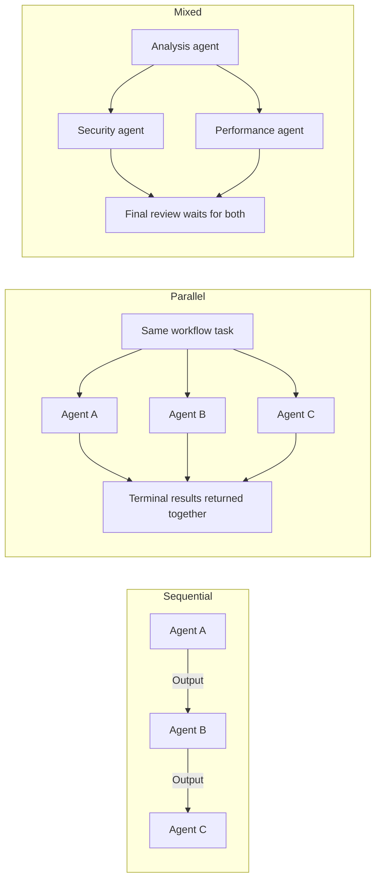

Independent branches run concurrently subject to the shared three-agent limit. A failed branch blocks its dependents; unrelated branches may finish. Aggregation preserves each source node/agent and its mapped result rather than silently merging objects.

## 14. Workflow output mapping

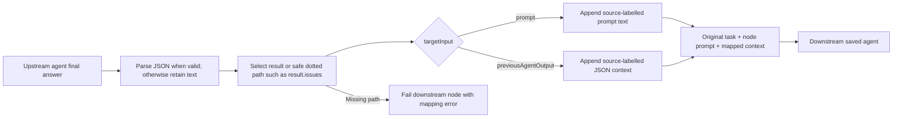

## 15. Code workspace and built-in tools

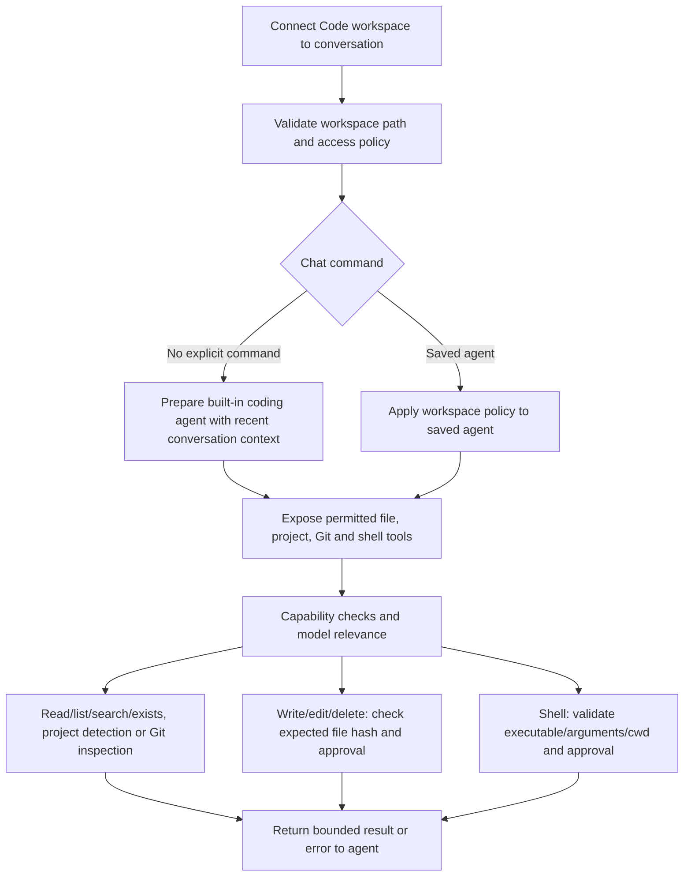

Workspace restrictions for built-in tools do not create an OS sandbox for custom tool code or an external MCP server. Tools requiring a project are filtered out when no project is available or the request forbids project access.

## 16. Save, import/export, groups and deletion

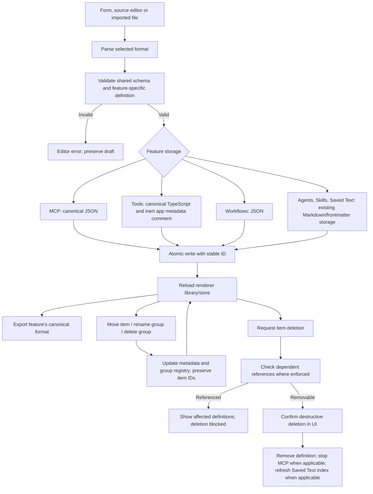

Library groups are organizational filters, not capability permissions or workflow dependency edges. Deleting a library group moves its members to the ungrouped state; it does not delete their definitions. Tool imports preview conversion before saving. KB source groups are metadata, while collections also provide retrieval scopes. Workflow duplication creates a new workflow ID.

## 17. Provider selection and credentials

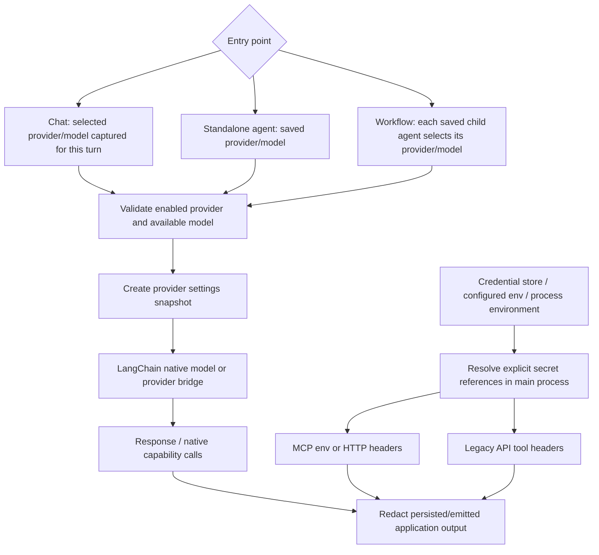

Chat-selected model settings can override the saved agent's model for that chat invocation. A workflow runs its saved child-agent models instead of overriding every node with the Chat model. Embeddings use the independently selected KB embedding model.

## 18. History, memory and Saved Text

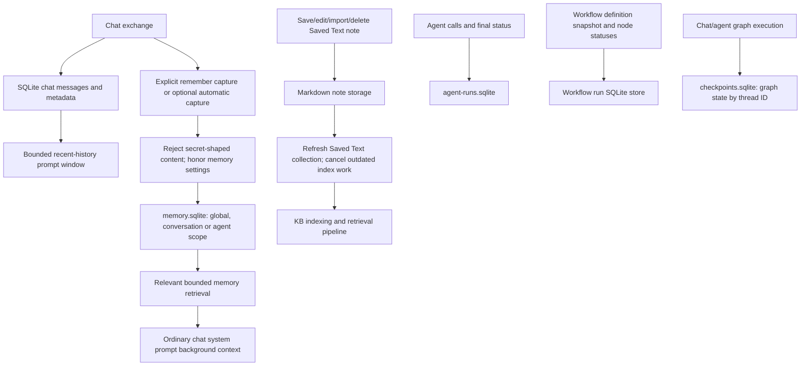

Transcripts, long-term memory, document vectors and graph checkpoints have different purposes. The ordinary Chat graph retrieves memory for the conversation. The current agent loop does not separately inject agent-scoped long-term memory, even though the memory API supports that scope. Saved Text remains saved if embedding fails; its KB source can be reindexed later.

## 19. Failure, approval, cancellation and restart lifecycle

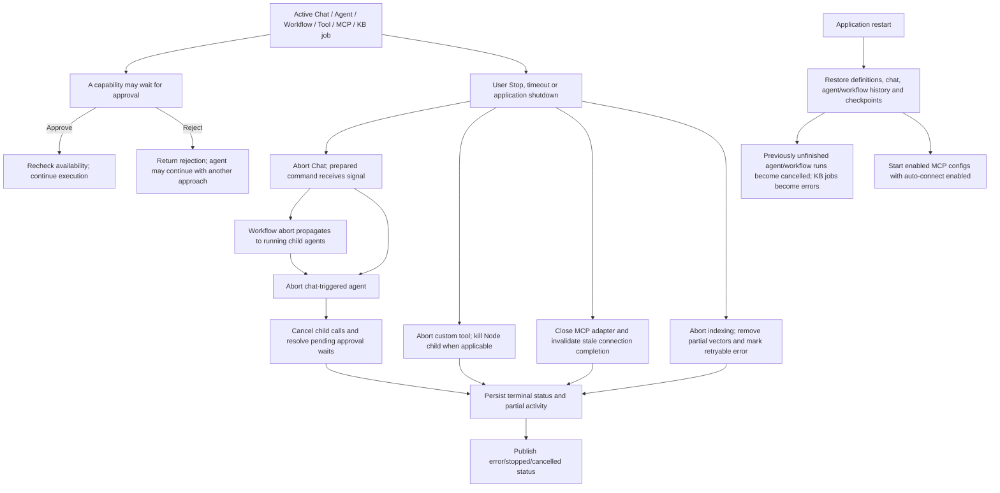

Capability errors are recorded and returned to the model so it can respond or recover. Admission failures, invalid final responses and unrecoverable graph errors fail the run. Workflow upstream failures prevent dependent agents from executing, but do not automatically stop every independent branch. The shutdown handler separately stops chat, workflows, agents, KB, MCP and custom tools before closing databases.

## 20. Full example with all requested features

Request: “Use our pricing KB, follow the quote-writing skill, fetch current customer details, calculate the quote and have a review agent check it.” This example uses a mixed workflow; the model may skip any unnecessary capability.

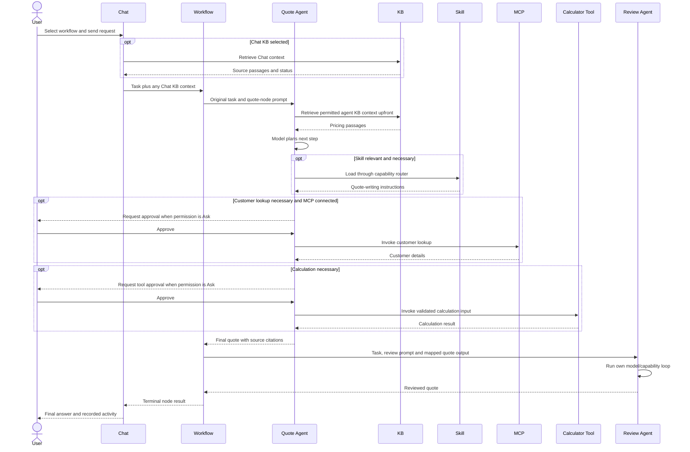

## Implementation references

- [Chat admission and command priority](src/main/services/ollama/chat.ts)
- [Chat command wrappers, skills and MCP connection behavior](src/main/services/ollama/commands.ts)
- [Chat turn graph, KB and memory context](src/main/services/ai/chat-graph.ts)
- [Agent registration, upfront KB retrieval and lifecycle](src/main/services/agents/agents.ts)
- [Agent model/tool loop and harness](src/main/services/ai/agent-graph.ts)
- [Capability modes, permissions, relevance and approval](src/main/services/agents/capabilities.ts)
- [Serialized calls and tool history](src/main/services/ai/capability-tools.ts)
- [MCP transports, discovery and invocation](src/main/services/mcp/mcp.ts)
- [Tools static parsing and conversion](src/main/services/tools/typescript.ts)
- [Tools execution and limits](src/main/services/tools/custom.ts)
- [KB indexing and retrieval](src/main/services/rag/knowledge.ts)
- [Workflow validation, edges and mappings](src/shared/workflows.ts)
- [Workflow definition storage](src/main/services/workflows/definitions.ts)
- [Workflow scheduling, failures and cancellation](src/main/services/workflows/workflows.ts)
- [Library storage and groups](src/main/services/filesystem/library.ts)
- [Provider capture](src/main/services/providers/router.ts)
- [Memory service](src/main/services/ai/memory.ts)
- [IPC validation and feature operations](src/main/ipc/register.ts)
- [Startup and shutdown](src/main/index.ts)
